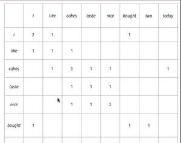
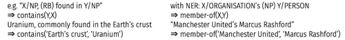
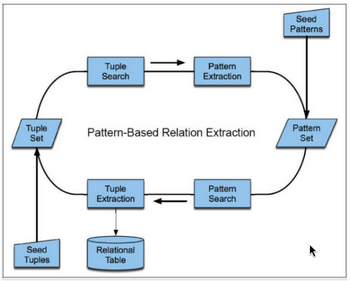
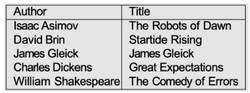

# W7 - Span Extraction
**Span extraction** - Extracting 0 or more contiguous spans from a piece of text.
**Keywords** - Contiguous spans of words in a document which summarise the content.
**Open information extraction** - Domain-independent discovery of relations, scaling the the size of the web corpus.
**Machine reading comprehension** - Finding a span in a passage which best answers a question about it.
Question -> Evidence retrieval -> MRC -> Answer with evidence

**Rapid automatic keyword extraction (RAKE)** - Identify spans between stopwords, and rank them by word frequency, degree, combinations, etc.

**Word co-occurrence matrix** - Record how words occur next to other in a corpus.

**Word degree** - How many connections a word has in total, e.g. cakes = 7.
**Generality** - Word degree / Word frequency (how much a word relates to other words)

## Pattern-Based Methods
**Pattern-based relation extraction** - Defining preset high-precision / low-recall patterns to extract relations.

Many hyponym-hypernym patterns available.

### DIPRE
**Dual iterative pattern relation expansion** - Tuples help find good patterns, patterns help find good tuples.

**Semantic drift** - The risk that small errors can propagate into larger ones.
By seeding with particular tuples, different patterns can arise.

Produces patterns, "X, a novel by Y."
Produces more author-title pairs, and so on.

Longer documents can be split into n chunks of size m and stride s (overlap).