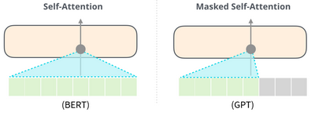
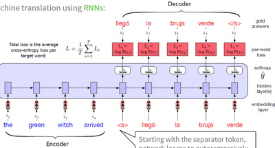
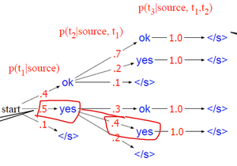
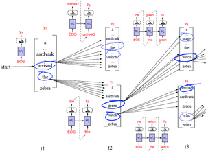
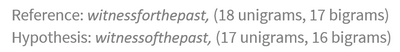
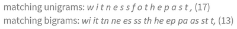
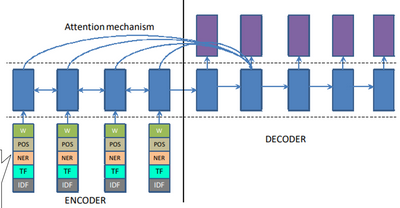

# W8 - Sequence-to-sequence Learning

## Natural Language Generation
Generative pre-trained (GPT) language models are built on a transformer.
Two training objectives:
- Language modelling with unsupervised training.
- Task-specific fine-tuning with supervised training for a target task.
They have multihead, masked self-attention.
**Multihead** - Each head learns a different aspect of the relationships between the input tokens.
**Masked self-attention** - Hides information from the tokens to the right of the current token being calculated.

### Seq2Seq Learning
This is the task of transforming one sequence into another, e.g. translation, text summarisation, semantic parsing.
It requires an encoder and a decoder. With an RNN:

Applications include:
- Paraphrase generation - Conversion from one NL sequence to another which preserves meaning.
- Semantic parsing - Conversion from input NL sequence to meaning representation language (MRL), just a data format.
- Long-form QA - Conversion from input question to paragraph-length answer.

**Text-to-text transfer transformer (T5)** - A framework which casts all NLP tasks as a seq2seq problem.

## Machine Translation

### Traditional approaches
- Rule-based - Simple rules for reordering word-by-word translation using a bilingual dictionary.
- Transer-based - Syntactic structure conversion, then generate output text based on the structure.
- Interlingua-based - Use an intermediate, language-independent formalism (interlingua) and generate from that.#

### Deep learning approaches
One can autoregressively predict the next word with an RNN.
**Greedy decoding** - Choosing the locally optimal next token.

**Beam search** - Select k best children, of those children select the best k, continue and recalculate scores for each hypothesis once k is reduced to 0.

One can also use transformers.

### Metrics
- Human evaluation by adequacy (semantic preservation) and fluency (grammatical correctness).
- **BiLingual evaluation understudy (BLEU)** - Precision-based metric using word overlap.
    - Can be modified to not reward spamming the same word.
- **BLEU-n** - N-gram overlap instead.
- **Character F-score** - Character n-gram overlaps, using F-score insteaad of precision.

## Auto Text Summarisation
**Extractive summarisation** - Extracts key phrases and sentences to put in the summary. Simpler, less cohesion.
**Abstractive summarisation** - Understands document content and compresses the text down to fewer words. Less redundancy, needs NLG.

### Traditional approaches (Extractive ATS only)
- Word frequency - A sentence is important if it contains a frequent word.
- TF-IDF - The same as above but TF-IDF.
- Binary classifiers - Uses features like sentence position, length, capitalisation, thematic words.
- Graph-based - Sentences are scored on similarity, forming a graph where nodes can be ranked.

### Deep learning approaches
- Attentional encoder-decoder RNNs - Simple.

- Switching generator / pointer model - OOV words are handled by pointing to the position in the word document.
- Transformers - Target is generated auto-regressively.

### Metrics
- Humans again, on readability, structure, clarity, etc.
- **ROUGE-n** - N-gram recall between candidate and reference.
- **ROUGE-L** - Longest common subsequence based F-score.
- **ROUGE-S** - Skip-bigram co-occurrence based F-score.